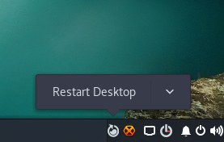
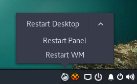

# Budgie Restart Applet
Restart Budgie panel/WM or both from the desktop itself.

## Installing

Run 'sudo ./install-applet.sh' from the source directory.

##### Written in Python ! ❤

#### -Gopikrishnan R (github.com/gkr09)

